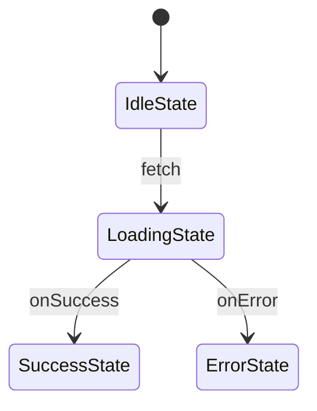

# Statechart Extraction System

## Table of Contents

1. [Overview](#overview)
2. [Philosophy & Design Rationale](#philosophy--design-rationale)
3. [Quick Start](#quick-start)
4. [Static Extraction (Build-Time)](#static-extraction-build-time)
   - [How It Works](#how-it-works)
   - [API Reference](#api-reference)
   - [Configuration](#configuration)
   - [CLI Tool](#cli-tool)
5. [Runtime Extraction](#runtime-extraction)
   - [Overview](#runtime-extraction-overview)
   - [API Reference](#runtime-extraction-api)
   - [Use Cases](#runtime-extraction-use-cases)
   - [Comparison with Static Extraction](#comparison-with-static-extraction)
6. [Type-Level Metadata DSL](#type-level-metadata-dsl)
7. [Output Formats](#output-formats)
8. [Limitations & Gotchas](#limitations--gotchas)
9. [Advanced Usage](#advanced-usage)
10. [Troubleshooting](#troubleshooting)

---

## Overview

The **Statechart Extraction System** provides **two complementary approaches** for generating formal statechart definitions (JSON) from TypeScript state machines:

1. **Static Extraction (Build-Time)** - AST-based analysis of TypeScript source code
2. **Runtime Extraction** - Symbol-based metadata collection from running instances

Both approaches generate [XState](https://xstate.js.org/)-compatible JSON that works with [Stately Viz](https://stately.ai/viz) and other statechart tooling.

### Key Features

**Static Extraction:**
- ✅ **Zero Runtime Overhead** - Pure build-time analysis
- ✅ **Source Code Analysis** - Works with TypeScript AST via ts-morph
- ✅ **Watch Mode** - Auto-regenerate statecharts during development
- ✅ **Multiple Machines** - Extract many machines with a single config file
- ✅ **CLI Tool** - Integrated build-time extraction workflow

**Runtime Extraction:**
- ✅ **No Source Required** - Extract from running machine instances
- ✅ **Browser DevTools** - Debug machines in production
- ✅ **Symbol-Based** - Non-enumerable metadata with zero performance impact
- ✅ **Dynamic Machines** - Works with computed values and runtime configuration

**Both Approaches:**
- ✅ **Type-Safe Annotations** - Use TypeScript types to document your machines
- ✅ **Full Metadata Support** - Extracts targets, guards, actions, invoke services, and descriptions
- ✅ **Compatible with XState** - Generated JSON works with XState v5 and Stately tooling

### What Gets Extracted

From your machine definitions, the system extracts:

- **States**: All class-based machine states
- **Transitions**: Event handlers with target states
- **Guards**: Conditional transitions (extracted as `cond` property)
- **Actions**: Side effects (extracted as `actions` array)
- **Invoke Services**: Async operations with `onDone`/`onError` targets
- **Descriptions**: Human-readable documentation for states and transitions

---

## Philosophy & Design Rationale

### Why Statechart Extraction?

**Type-State Programming** (the core paradigm of `@doeixd/machine`) provides compile-time safety through TypeScript's type system. However, this approach has a blind spot: **visualizing and communicating the state machine to stakeholders**.

Traditional statechart tools like XState excel at visualization and formal verification, but require runtime configuration objects. The extraction system provides the best of both worlds:

1. **Type-Safe Development** - Write machines with full TypeScript safety
2. **Visual Communication** - Generate diagrams for documentation and review
3. **Formal Verification** - Use XState tooling to validate state machines
4. **No Runtime Cost** - Extraction happens at build time, zero production overhead

### Design Principles

#### 1. **Static Analysis Over Runtime Reflection**

**Decision**: Use TypeScript Compiler API (ts-morph) for static analysis instead of runtime decorators or metadata collection.

**Rationale**:
- Zero runtime overhead
- Works with dead code and unexecuted paths
- No need to instantiate machines
- Compatible with tree-shaking and bundlers

**Trade-off**: Requires build step, but this is standard for TypeScript projects.

#### 2. **AST Parsing Over Type System Resolution**

**Decision**: Parse the Abstract Syntax Tree of DSL primitive calls instead of relying on TypeScript's type system.

**Rationale**:
TypeScript's type system is designed for type checking, not metadata extraction. When using branded intersection types like `WithMeta<F, M>`, the type checker resolves generic type parameters (`M extends TransitionMeta`) rather than their concrete instantiations (`{ target: LoggedInMachine, description: "..." }`).

**Original Approach (Failed)**:
```typescript
// This doesn't work - TypeScript sees "M extends TransitionMeta", not the concrete type
type WithMeta<F, M> = F & { [META_KEY]: M };
```

**Current Approach (AST-Based)**:
```typescript
// Parse the actual source code to extract literal arguments
login = describe(
  "Start login",  // ← Extract this string literal
  transitionTo(LoggedInMachine, ...) // ← Extract this class identifier
)
```

This is the same approach used by XState's `@xstate/machine-extractor` and is proven reliable.

#### 3. **Type-Level Metadata for Documentation**

**Decision**: Keep the type-level metadata DSL (`transitionTo`, `describe`, etc.) even though we use AST parsing.

**Rationale**:
- **Type Safety**: The DSL provides compile-time type checking
- **Documentation**: Types serve as inline documentation
- **IDE Support**: Autocomplete and IntelliSense work perfectly
- **Consistency Check**: AST extraction can validate against types (hybrid approach)

**Example**:
```typescript
// The DSL provides type safety AND enables extraction
login = describe(
  "Authenticates the user",
  transitionTo(LoggedInMachine, (username: string) => {
    // TypeScript ensures this returns LoggedInMachine
    return new LoggedInMachine({ username });
  })
);
```

---

## Quick Start

### Installation

The extraction tools are included in `@doeixd/machine`. Install the package:

```bash
npm install @doeixd/machine
```

### Basic Usage

1. **Annotate your machines** with DSL primitives:

```typescript
import { MachineBase } from '@doeixd/machine';
import { transitionTo, describe, action } from '@doeixd/machine/primitives';

class Idle extends MachineBase<{ status: 'idle' }> {
  start = describe(
    "Start the process",
    action(
      { name: "logStart", description: "Log process start" },
      transitionTo(Running, () => new Running({ status: 'running' }))
    )
  );
}

class Running extends MachineBase<{ status: 'running' }> {
  stop = describe(
    "Stop the process",
    transitionTo(Idle, () => new Idle({ status: 'idle' }))
  );
}
```

2. **Create a config file** (`.statechart.config.ts`):

```typescript
import type { ExtractionConfig } from '@doeixd/machine';

export default {
  machines: [{
    input: 'src/myMachine.ts',
    classes: ['Idle', 'Running'],
    output: 'statecharts/my-machine.json',
    id: 'myMachine',
    initialState: 'Idle'
  }],
  verbose: true
} satisfies ExtractionConfig;
```

3. **Run extraction**:

```bash
npx tsx scripts/extract-statechart.ts --config .statechart.config.ts
```

Or add to `package.json`:

```json
{
  "scripts": {
    "extract": "tsx scripts/extract-statechart.ts --config .statechart.config.ts"
  }
}
```

4. **View the statechart** in [Stately Viz](https://stately.ai/viz):
   - Go to https://stately.ai/viz
   - Paste the contents of `statecharts/my-machine.json`
   - Visualize and validate your state machine

---

## Static Extraction (Build-Time)

### How It Works

#### Architecture Overview

```
┌─────────────────────────────────────────────────────────────┐
│                  TypeScript Source Code                      │
│  (Machines with DSL annotations)                            │
└────────────────────┬────────────────────────────────────────┘
                     │
                     ▼
┌─────────────────────────────────────────────────────────────┐
│              TypeScript Compiler API (ts-morph)              │
│  • Parse source files into AST                              │
│  • Find class declarations                                  │
│  • Extract instance members                                 │
└────────────────────┬────────────────────────────────────────┘
                     │
                     ▼
┌─────────────────────────────────────────────────────────────┐
│             AST-Based Metadata Extraction                    │
│  • Find DSL primitive calls (transitionTo, etc.)            │
│  • Parse call expression arguments                          │
│  • Extract literal values                                   │
│  • Resolve class name identifiers                          │
└────────────────────┬────────────────────────────────────────┘
                     │
                     ▼
┌─────────────────────────────────────────────────────────────┐
│              JSON Statechart Generation                      │
│  • Build XState-compatible structure                        │
│  • Format states and transitions                            │
│  • Add metadata (guards, actions, invoke)                  │
└────────────────────┬────────────────────────────────────────┘
                     │
                     ▼
┌─────────────────────────────────────────────────────────────┐
│                  Output (JSON/Mermaid)                       │
│  • Write to file or stdout                                  │
│  • Optional validation against schema                       │
└─────────────────────────────────────────────────────────────┘
```

### Step-by-Step Process

#### 1. **Source File Parsing**

The system uses `ts-morph` (a wrapper around TypeScript's Compiler API) to parse your source files:

```typescript
const project = new Project();
project.addSourceFilesAtPaths("src/**/*.ts");
const sourceFile = project.getSourceFile("src/myMachine.ts");
```

#### 2. **Class Analysis**

For each class in the configuration, the analyzer:

```typescript
const classDeclaration = sourceFile.getClass("IdleMachine");
const instanceMembers = classDeclaration.getInstanceMembers();
```

#### 3. **AST-Based Metadata Extraction**

For each member, the system:

1. **Checks if it's a property declaration** with an initializer
2. **Verifies the initializer is a call expression** (DSL primitive)
3. **Recursively parses nested calls** to extract all metadata
4. **Resolves class names and literal values** from the AST

**Example AST Structure**:
```typescript
login = describe(
  "Start login",
  action(
    { name: "log" },
    transitionTo(LoggedIn, ...)
  )
)
```

Parsed as:
```
CallExpression (describe)
├─ StringLiteral: "Start login"
└─ CallExpression (action)
   ├─ ObjectLiteral: { name: "log" }
   └─ CallExpression (transitionTo)
      ├─ Identifier: LoggedIn
      └─ ArrowFunction: (...)
```

#### 4. **Metadata Aggregation**

The extracted metadata is aggregated:

```typescript
{
  description: "Start login",
  actions: [{ name: "log" }],
  target: "LoggedIn"
}
```

#### 5. **State Node Construction**

For each state, a state node is built:

```typescript
{
  "IdleMachine": {
    "on": {
      "login": {
        "target": "LoggedIn",
        "description": "Start login",
        "actions": ["log"]
      }
    }
  }
}
```

#### 6. **Chart Assembly**

All state nodes are assembled into a complete statechart:

```typescript
{
  "id": "auth",
  "initial": "IdleMachine",
  "states": { ... }
}
```

---

## API Reference

### Configuration Types

#### `MachineConfig`

Configuration for a single machine to extract.

```typescript
interface MachineConfig {
  /** Path to the source file containing the machine */
  input: string;

  /** Array of class names that represent states */
  classes: string[];

  /** Output file path (optional, defaults to stdout) */
  output?: string;

  /** Top-level ID for the statechart */
  id: string;

  /** Name of the class that represents the initial state */
  initialState: string;

  /** Optional description of the machine */
  description?: string;
}
```

**Example**:
```typescript
{
  input: 'src/auth.ts',
  classes: ['LoggedOut', 'LoggedIn'],
  output: 'statecharts/auth.json',
  id: 'auth',
  initialState: 'LoggedOut',
  description: 'User authentication flow'
}
```

#### `ExtractionConfig`

Global extraction configuration.

```typescript
interface ExtractionConfig {
  /** Array of machines to extract */
  machines: MachineConfig[];

  /** Validate output against XState JSON schema (optional) */
  validate?: boolean;

  /** Output format: 'json', 'mermaid', or 'both' */
  format?: 'json' | 'mermaid' | 'both';

  /** Watch mode - auto-regenerate on file changes */
  watch?: boolean;

  /** Verbose logging */
  verbose?: boolean;
}
```

**Example**:
```typescript
{
  machines: [
    { input: 'src/auth.ts', classes: [...], id: 'auth', ... },
    { input: 'src/fetch.ts', classes: [...], id: 'fetch', ... }
  ],
  validate: true,
  format: 'json',
  verbose: true,
  watch: false
}
```

### Extraction Functions

#### `extractMachine(config, project, verbose?)`

Extracts a single machine configuration to a statechart.

```typescript
function extractMachine(
  config: MachineConfig,
  project: Project,
  verbose?: boolean
): any
```

**Parameters**:
- `config` - Machine configuration
- `project` - ts-morph Project instance
- `verbose` - Enable debug logging

**Returns**: The generated statechart object

**Example**:
```typescript
import { Project } from 'ts-morph';
import { extractMachine } from '@doeixd/machine';

const project = new Project();
project.addSourceFilesAtPaths("src/**/*.ts");

const chart = extractMachine({
  input: 'src/auth.ts',
  classes: ['LoggedOut', 'LoggedIn'],
  id: 'auth',
  initialState: 'LoggedOut'
}, project, true);

console.log(JSON.stringify(chart, null, 2));
```

#### `extractMachines(config)`

Extracts multiple machines based on configuration.

```typescript
function extractMachines(config: ExtractionConfig): any[]
```

**Parameters**:
- `config` - Full extraction configuration

**Returns**: Array of generated statecharts

**Example**:
```typescript
import { extractMachines } from '@doeixd/machine';

const charts = extractMachines({
  machines: [
    { input: 'src/auth.ts', classes: ['LoggedOut', 'LoggedIn'], id: 'auth', initialState: 'LoggedOut' },
    { input: 'src/fetch.ts', classes: ['Idle', 'Loading'], id: 'fetch', initialState: 'Idle' }
  ],
  verbose: true
});

charts.forEach((chart, i) => {
  console.log(`Machine ${i}:`, chart);
});
```

#### `generateChart()` (Legacy)

Legacy function for backwards compatibility. Extracts a single hardcoded machine.

```typescript
function generateChart(): void
```

**Deprecated**: Use `extractMachine` or `extractMachines` instead.

---

## Configuration

### Config File Formats

The extraction system supports two config file formats:

#### TypeScript (.statechart.config.ts)

**Recommended** - Provides type safety and IDE support.

```typescript
import type { ExtractionConfig } from '@doeixd/machine';

const config: ExtractionConfig = {
  machines: [
    {
      input: 'src/auth.ts',
      classes: ['LoggedOut', 'LoggingIn', 'LoggedIn'],
      output: 'statecharts/auth.json',
      id: 'auth',
      initialState: 'LoggedOut',
      description: 'Authentication state machine'
    }
  ],
  validate: true,
  format: 'json',
  verbose: true
};

export default config;
```

#### JSON (statechart.config.json)

```json
{
  "machines": [
    {
      "input": "src/auth.ts",
      "classes": ["LoggedOut", "LoggingIn", "LoggedIn"],
      "output": "statecharts/auth.json",
      "id": "auth",
      "initialState": "LoggedOut",
      "description": "Authentication state machine"
    }
  ],
  "validate": true,
  "format": "json",
  "verbose": true
}
```

### Multi-Machine Configuration

Extract multiple machines in one pass:

```typescript
export default {
  machines: [
    {
      input: 'src/auth.ts',
      classes: ['LoggedOut', 'LoggedIn'],
      output: 'statecharts/auth.json',
      id: 'auth',
      initialState: 'LoggedOut'
    },
    {
      input: 'src/data-fetching.ts',
      classes: ['Idle', 'Loading', 'Success', 'Error'],
      output: 'statecharts/fetch.json',
      id: 'dataFetch',
      initialState: 'Idle'
    },
    {
      input: 'src/wizard.ts',
      classes: ['Step1', 'Step2', 'Step3', 'Complete'],
      output: 'statecharts/wizard.json',
      id: 'wizard',
      initialState: 'Step1'
    }
  ],
  verbose: true,
  format: 'json'
} satisfies ExtractionConfig;
```

---

## Type-Level Metadata DSL

The DSL provides type-safe annotations that are:
1. **Identity functions at runtime** (zero overhead)
2. **Type metadata at compile-time** (documentation and safety)
3. **Parsed by the extractor** (statechart generation)

### Primitives Reference

#### `transitionTo<T, F>(target, implementation)`

Declares that a transition targets a specific state class.

```typescript
function transitionTo<
  T extends ClassConstructor,
  F extends (...args: any[]) => any
>(
  target: T,
  implementation: F
): WithMeta<F, { target: T }>
```

**Example**:
```typescript
login = transitionTo(
  LoggedInMachine,
  (username: string) => new LoggedInMachine({ username })
);
```

**Extracted as**:
```json
{
  "login": {
    "target": "LoggedInMachine"
  }
}
```

#### `describe<F, M>(text, transition)`

Adds human-readable documentation to a transition.

```typescript
function describe<
  F extends (...args: any[]) => any,
  M extends TransitionMeta
>(
  text: string,
  transition: WithMeta<F, M>
): WithMeta<F, M & { description: string }>
```

**Example**:
```typescript
logout = describe(
  "Logs the user out and clears session data",
  transitionTo(LoggedOutMachine, () => new LoggedOutMachine())
);
```

**Extracted as**:
```json
{
  "logout": {
    "target": "LoggedOutMachine",
    "description": "Logs the user out and clears session data"
  }
}
```

#### `guarded<F, M>(guard, transition)`

Annotates a transition with a guard condition.

```typescript
function guarded<
  F extends (...args: any[]) => any,
  M extends TransitionMeta
>(
  guard: GuardMeta,
  transition: WithMeta<F, M>
): WithMeta<F, M & { guards: [typeof guard] }>

interface GuardMeta {
  name: string;
  description?: string;
}
```

**Example**:
```typescript
deleteAccount = guarded(
  { name: "isAdmin", description: "Only admins can delete" },
  transitionTo(DeletedMachine, () => new DeletedMachine())
);
```

**Extracted as**:
```json
{
  "deleteAccount": {
    "target": "DeletedMachine",
    "cond": "isAdmin"
  }
}
```

**Important**: The `guarded()` function only records metadata. You must implement the actual guard logic:

```typescript
deleteAccount(userId: string) {
  if (!this.context.isAdmin) {
    throw new Error("Unauthorized");  // Implement the guard
  }
  return new DeletedMachine();
}
```

#### `invoke<D, E, F>(service, implementation)`

Declares that a transition/state involves an asynchronous service.

```typescript
function invoke<
  D extends ClassConstructor,
  E extends ClassConstructor,
  F extends (...args: any[]) => any
>(
  service: {
    src: string;
    onDone: D;
    onError: E;
    description?: string;
  },
  implementation: F
): WithMeta<F, { invoke: typeof service }>
```

**Example**:
```typescript
class Loading extends MachineBase<{ status: 'loading' }> {
  fetchData = invoke(
    {
      src: "fetchUserData",
      onDone: SuccessMachine,
      onError: ErrorMachine,
      description: "Fetches user profile from API"
    },
    async (userId: string) => {
      try {
        const data = await api.getUser(userId);
        return new SuccessMachine({ data });
      } catch (error) {
        return new ErrorMachine({ error: error.message });
      }
    }
  );
}
```

**Extracted as**:
```json
{
  "LoadingMachine": {
    "invoke": [{
      "src": "fetchUserData",
      "onDone": { "target": "SuccessMachine" },
      "onError": { "target": "ErrorMachine" },
      "description": "Fetches user profile from API"
    }]
  }
}
```

#### `action<F, M>(action, transition)`

Annotates a transition with a side-effect action.

```typescript
function action<
  F extends (...args: any[]) => any,
  M extends TransitionMeta
>(
  action: ActionMeta,
  transition: WithMeta<F, M>
): WithMeta<F, M & { actions: [typeof action] }>

interface ActionMeta {
  name: string;
  description?: string;
}
```

**Example**:
```typescript
submit = action(
  { name: "trackSubmission", description: "Log to analytics" },
  transitionTo(SubmittedMachine, (data) => {
    analytics.track("form_submit", data);
    return new SubmittedMachine({ data });
  })
);
```

**Extracted as**:
```json
{
  "submit": {
    "target": "SubmittedMachine",
    "actions": ["trackSubmission"]
  }
}
```

### Composing Primitives

DSL functions compose through nesting. Each wrapper adds metadata:

```typescript
class AdminMachine extends MachineBase<{ role: 'admin' }> {
  deleteUser = describe(
    "Permanently removes a user from the system",
    guarded(
      { name: "hasDeletePermission" },
      action(
        { name: "auditLog" },
        transitionTo(UserDeletedMachine, (userId: string) => {
          auditLog.record("user_deleted", userId);
          return new UserDeletedMachine({ userId });
        })
      )
    )
  );
}
```

**Extracted as**:
```json
{
  "deleteUser": {
    "target": "UserDeletedMachine",
    "description": "Permanently removes a user from the system",
    "cond": "hasDeletePermission",
    "actions": ["auditLog"]
  }
}
```

---

## CLI Tool

### Command-Line Options

```bash
tsx scripts/extract-statechart.ts [options]
```

| Option | Alias | Description | Default |
|--------|-------|-------------|---------|
| `--input <file>` | `-i` | Input file containing machine definitions | - |
| `--output <file>` | `-o` | Output file for the generated statechart | stdout |
| `--config <file>` | `-c` | Configuration file path | `.statechart.config.ts` |
| `--watch` | `-w` | Watch mode - regenerate on file changes | false |
| `--format <type>` | `-f` | Output format: `json`, `mermaid`, or `both` | `json` |
| `--validate` | - | Validate output against XState JSON schema | false |
| `--verbose` | `-v` | Verbose logging | false |
| `--id <id>` | - | Machine ID (required with `--input`) | - |
| `--classes <classes>` | - | Comma-separated list of class names | - |
| `--initial <state>` | - | Initial state class name | - |

### Usage Examples

#### Extract from config file:
```bash
tsx scripts/extract-statechart.ts --config .statechart.config.ts
```

#### Extract a single machine:
```bash
tsx scripts/extract-statechart.ts \
  --input src/auth.ts \
  --id auth \
  --classes LoggedOut,LoggedIn \
  --initial LoggedOut \
  --output statecharts/auth.json
```

#### Watch mode:
```bash
tsx scripts/extract-statechart.ts --config .statechart.config.ts --watch
```

#### Verbose output:
```bash
tsx scripts/extract-statechart.ts --config .statechart.config.ts --verbose
```

#### Output to stdout:
```bash
tsx scripts/extract-statechart.ts \
  --input src/auth.ts \
  --id auth \
  --classes LoggedOut,LoggedIn \
  --initial LoggedOut
```

### npm Scripts

Add to your `package.json`:

```json
{
  "scripts": {
    "extract": "tsx scripts/extract-statechart.ts --config .statechart.config.ts",
    "extract:watch": "tsx scripts/extract-statechart.ts --config .statechart.config.ts --watch",
    "extract:validate": "tsx scripts/extract-statechart.ts --config .statechart.config.ts --validate"
  }
}
```

Then run:
```bash
npm run extract          # Extract once
npm run extract:watch    # Watch mode
npm run extract:validate # With validation
```

---

## Runtime Extraction

### Overview

Runtime extraction generates statecharts from **running machine instances** using Symbol-based metadata attached to functions at runtime. Unlike static extraction which requires TypeScript source code, runtime extraction works with live instances in any JavaScript environment.

**Key Benefits:**
- 🐛 **Debug Production** - Extract statecharts from running machines without source access
- 🌐 **Browser DevTools** - Inspect machines directly in the browser console
- 🧪 **Testing** - Generate diagrams from test instances
- 📦 **Dynamic Machines** - Works with machines created with computed values
- ⚡ **Zero Performance Impact** - Metadata stored in non-enumerable Symbols

### How It Works

When you use DSL primitives (`transitionTo`, `describe`, `action`, etc.), they attach runtime metadata to your transition functions using a non-enumerable Symbol property:

```typescript
// This primitive attaches metadata at runtime
const login = transitionTo(LoggedIn, (username) => new LoggedIn({ username }));

// Metadata is stored as: login[RUNTIME_META] = { target: "LoggedIn" }
```

**The Symbol-based approach:**
1. Each DSL primitive calls `attachRuntimeMeta(fn, metadata)`
2. Metadata is stored via `Object.defineProperty` with `enumerable: false`
3. Nested primitives merge metadata on the same function (composition)
4. Extraction reads `fn[RUNTIME_META]` from each transition method

**Why Symbols?**
- **Non-enumerable**: Invisible to `for...in`, `Object.keys()`, JSON.stringify
- **No collisions**: Unique symbol prevents naming conflicts
- **Composable**: `configurable: true` allows metadata accumulation
- **Type-safe**: TypeScript sees the branded types

### API Reference

#### `extractFunctionMetadata(fn)`

Extract metadata from a single function if it has runtime metadata attached.

```typescript
import { extractFunctionMetadata } from '@doeixd/machine';

const fn = transitionTo(TargetState, () => new TargetState());
const meta = extractFunctionMetadata(fn);

console.log(meta);
// { target: "TargetState" }
```

**Returns:** `RuntimeTransitionMeta | null`

---

#### `extractStateNode(stateInstance)`

Extract a complete state node from a machine class instance.

```typescript
import { extractStateNode } from '@doeixd/machine';

class LoggedOut extends MachineBase<Context> {
  login = describe(
    "User logs in",
    transitionTo(LoggedIn, (username) => new LoggedIn({ username }))
  );
}

const instance = new LoggedOut({ status: 'loggedOut' });
const stateNode = extractStateNode(instance);

console.log(stateNode);
// {
//   on: {
//     login: {
//       target: "LoggedIn",
//       description: "User logs in"
//     }
//   }
// }
```

**Returns:** XState-compatible state node object

---

#### `generateStatechart(states, config)`

Generate a complete statechart from multiple state class instances.

```typescript
import { generateStatechart } from '@doeixd/machine';

const chart = generateStatechart({
  LoggedOut: new LoggedOut({ status: 'loggedOut' }),
  LoggedIn: new LoggedIn({ status: 'loggedIn', token: '' })
}, {
  id: 'auth',
  initial: 'LoggedOut',
  description: 'User authentication state machine'
});

console.log(JSON.stringify(chart, null, 2));
```

**Parameters:**
- `states`: Object mapping state names to state instances
- `config.id`: Machine identifier
- `config.initial`: Initial state name
- `config.description` (optional): Machine description

**Returns:** XState-compatible statechart JSON

---

#### `extractFromInstance(machineInstance, config)`

Convenience function to extract a statechart from a single machine instance.

```typescript
import { extractFromInstance } from '@doeixd/machine';

const machine = new LoggedOut({ status: 'loggedOut' });

const chart = extractFromInstance(machine, {
  id: 'auth',
  stateName: 'LoggedOut' // optional, defaults to constructor.name
});
```

**Parameters:**
- `machineInstance`: Machine instance to extract from
- `config.id`: Machine identifier
- `config.stateName` (optional): State name (defaults to `constructor.name`)

**Returns:** XState-compatible statechart JSON

### Use Cases

#### 1. Browser DevTools Debugging

```typescript
// In your app
let currentMachine = new LoggedOut({ status: 'loggedOut' });

// In browser console
const chart = extractFromInstance(currentMachine, { id: 'debug' });
copy(JSON.stringify(chart, null, 2)); // Copy to clipboard

// Paste into https://stately.ai/viz to visualize
```

#### 2. Production Debugging

```typescript
// Without access to source code
import { generateStatechart } from '@doeixd/machine';

function debugMachine(machineInstance) {
  const chart = extractFromInstance(machineInstance, { id: 'debug' });
  console.log('Current machine structure:', chart);
  return chart;
}

// Call from production console
debugMachine(window.__currentMachine);
```

#### 3. Test Fixtures

```typescript
import { describe, it, expect } from 'vitest';
import { generateStatechart } from '@doeixd/machine';

it('should have correct state structure', () => {
  const chart = generateStatechart({
    Idle: new IdleState(),
    Loading: new LoadingState(),
    Success: new SuccessState()
  }, { id: 'test', initial: 'Idle' });

  expect(chart.states.Idle.on.load).toBeDefined();
  expect(chart.states.Idle.on.load.target).toBe('Loading');
});
```

#### 4. Dynamic Machine Documentation

```typescript
// Generate docs for machines created at runtime
function createDynamicMachine(config) {
  // Build machine based on config...
  const machine = buildMachineFromConfig(config);

  // Extract and save statechart
  const chart = extractFromInstance(machine, {
    id: `dynamic-${config.name}`
  });

  fs.writeFileSync(
    `docs/machines/${config.name}.json`,
    JSON.stringify(chart, null, 2)
  );
}
```

### Comparison with Static Extraction

| Aspect | Static (AST-based) | Runtime (Symbol-based) |
|--------|-------------------|------------------------|
| **When** | Build time | Runtime |
| **Requires** | TypeScript source | Running instance |
| **Input** | Source file path | Machine instances |
| **How** | Parse AST with ts-morph | Read Symbol properties |
| **Overhead** | None (build time only) | Minimal (metadata on functions) |
| **Dynamic values** | ❌ Only literals | ✅ Resolves at runtime |
| **Browser DevTools** | ❌ Not available | ✅ Works in console |
| **CI/CD Integration** | ✅ Easy | ❌ Requires running app |
| **Watch Mode** | ✅ Available | ❌ Manual |
| **Best for** | Documentation, builds | Debugging, production |

**Recommendation**: Use both approaches - static extraction for build-time documentation and CI/CD, runtime extraction for debugging and production inspection.

### Memory & Performance Impact

**Overhead per annotated function:**
- Symbol property: ~40-80 bytes (depends on metadata size)
- For a machine with 10 transitions: ~400-800 bytes total
- **Verdict**: Negligible for most applications

**Runtime overhead:**
- `Object.defineProperty()`: ~0.1-0.5μs per call (during machine creation)
- Metadata access: Direct property lookup (Symbol key)
- **Verdict**: Zero measurable impact on application performance

**Extraction performance:**
- Iterate over object properties: ~1-5μs per property
- **Verdict**: Fast enough for debugging/development use

---

## Output Formats

### JSON (XState Compatible)

The default output format is JSON compatible with XState v5 and Stately Viz.

**Structure**:
```json
{
  "id": "machineName",
  "initial": "InitialState",
  "description": "Optional machine description",
  "states": {
    "StateName": {
      "on": {
        "eventName": {
          "target": "TargetState",
          "description": "Transition description",
          "cond": "guardName",
          "actions": ["actionName1", "actionName2"]
        }
      },
      "invoke": [{
        "src": "serviceName",
        "onDone": { "target": "SuccessState" },
        "onError": { "target": "ErrorState" },
        "description": "Service description"
      }]
    }
  }
}
```

### Mermaid (Diagram)

**Coming Soon** - Generate Mermaid state diagrams for documentation.



---

## Limitations & Gotchas

### Known Limitations

#### 1. **Class-Based Machines Only**

The extraction system currently only supports **class-based machines** that extend `MachineBase`.

**Supported** ✅:
```typescript
class IdleMachine extends MachineBase<{ status: 'idle' }> {
  start = transitionTo(RunningMachine, () => new RunningMachine());
}
```

**Not Supported** ❌:
```typescript
// Functional machines - extraction not implemented
const machine = createMachine({ status: 'idle' }, {
  start: () => createMachine({ status: 'running' }, {})
});
```

**Workaround**: Use class-based machines for extraction. Functional machines still work at runtime, they just can't be extracted.

#### 2. **Literal Arguments Required**

The AST parser extracts **literal values** from DSL primitive calls. Dynamic or computed values cannot be extracted.

**Supported** ✅:
```typescript
login = describe(
  "Start login process",  // ✅ String literal
  transitionTo(LoggedInMachine, ...)  // ✅ Identifier
);
```

**Not Supported** ❌:
```typescript
const description = getDescription();  // Computed value
login = describe(
  description,  // ❌ Not a literal
  transitionTo(getTargetClass(), ...)  // ❌ Function call
);
```

**Workaround**: Use literal values in DSL annotations. Computed logic can still exist in the implementation function.

#### 3. **Source Code Must Be Available**

Static analysis requires access to TypeScript source files. The extraction won't work on:
- Compiled JavaScript files
- Type declaration files (`.d.ts`)
- External packages without source

**Workaround**: Extract before compilation as part of your build process.

#### 4. **Guard and Action Implementations Not Extracted**

The system extracts metadata about guards and actions, but not their implementation logic.

```typescript
deleteUser = guarded(
  { name: "isAdmin" },  // ✅ Extracted
  transitionTo(DeletedMachine, (userId) => {
    // ❌ This implementation is NOT extracted
    if (!this.context.isAdmin) {
      throw new Error("Unauthorized");
    }
    return new DeletedMachine();
  })
);
```

**Extracted**:
```json
{
  "deleteUser": {
    "target": "DeletedMachine",
    "cond": "isAdmin"  // ← Name only, not implementation
  }
}
```

**This is intentional** - XState statecharts reference guard/action names, implementations are defined separately.

### Common Gotchas

#### Gotcha 1: Forgetting to Export State Classes

If you don't export the state classes, the extractor can't find them.

**Wrong** ❌:
```typescript
class IdleMachine extends MachineBase<{ status: 'idle' }> {
  // ...
}
```

**Correct** ✅:
```typescript
export class IdleMachine extends MachineBase<{ status: 'idle' }> {
  // ...
}
```

#### Gotcha 2: Mismatched Class Names

The class names in your config must exactly match the class declarations.

**Config**:
```typescript
classes: ['IdleMachine', 'RunningMachine']
```

**Source** (case must match):
```typescript
export class IdleMachine { ... }  // ✅ Matches
export class Idle { ... }         // ❌ Doesn't match
```

#### Gotcha 3: Circular Dependencies

If your state classes have circular dependencies, TypeScript may have trouble resolving types.

**Workaround**: Use forward references or type imports:
```typescript
import type { LoggedInMachine } from './logged-in';
```

#### Gotcha 4: Missing Primitives Import

Always import primitives from `@doeixd/machine/primitives` or directly from the package:

```typescript
// ✅ Correct
import { transitionTo, describe } from '@doeixd/machine/primitives';

// ❌ Wrong (won't be recognized by extractor)
const transitionTo = (target, impl) => impl;
```

---

## Advanced Usage

### Custom Extraction in Build Pipeline

Integrate extraction into your build process:

**Vite Plugin Example**:
```typescript
import { Plugin } from 'vite';
import { extractMachines } from '@doeixd/machine';
import config from './.statechart.config';

export function statechartPlugin(): Plugin {
  return {
    name: 'vite-plugin-statechart-extraction',
    buildStart() {
      extractMachines(config);
      console.log('✅ Statecharts extracted');
    }
  };
}
```

### Programmatic Usage

Use the extraction API in Node.js scripts:

```typescript
import { Project } from 'ts-morph';
import { extractMachine } from '@doeixd/machine';
import * as fs from 'fs';

const project = new Project();
project.addSourceFilesAtPaths('src/**/*.ts');

const chart = extractMachine({
  input: 'src/auth.ts',
  classes: ['LoggedOut', 'LoggedIn'],
  id: 'auth',
  initialState: 'LoggedOut'
}, project, true);

// Custom processing
const simplified = {
  ...chart,
  states: Object.fromEntries(
    Object.entries(chart.states).map(([name, state]) => [
      name.replace('Machine', ''),
      state
    ])
  )
};

fs.writeFileSync('output/auth.json', JSON.stringify(simplified, null, 2));
```

### Type Validation (Hybrid Approach)

For maximum safety, validate AST extraction against type metadata:

```typescript
// In extract.ts, add:
function validateMetadata(member: Node, astMeta: any) {
  const typeMeta = extractMetaFromType(member.getType());

  if (typeMeta?.target && astMeta.target !== typeMeta.target) {
    console.warn(`⚠️ Target mismatch: AST says ${astMeta.target}, types say ${typeMeta.target}`);
  }

  // This catches bugs where implementation doesn't match types
}
```

---

## Troubleshooting

### Problem: "Source file not found"

**Error**:
```
❌ Error: Source file not found: src/myMachine.ts
```

**Causes**:
1. File path is incorrect in config
2. File doesn't exist
3. TypeScript can't resolve the file

**Solutions**:
- Use relative paths from project root
- Check file exists: `ls src/myMachine.ts`
- Ensure file has `.ts` extension

### Problem: "Class not found in source file"

**Error**:
```
⚠️ Warning: Class 'MyMachine' not found in 'src/myMachine.ts'. Skipping.
```

**Causes**:
1. Class name doesn't match config
2. Class is not exported
3. TypeScript syntax error in file

**Solutions**:
- Verify class name matches exactly (case-sensitive)
- Add `export` to class declaration
- Run `tsc --noEmit` to check for syntax errors

### Problem: "No metadata extracted"

**Symptom**: Empty `on: {}` objects in generated JSON.

**Causes**:
1. Not using DSL primitives
2. Primitives imported from wrong source
3. Property not using arrow function or method syntax

**Solutions**:
```typescript
// ✅ Correct
import { transitionTo } from '@doeixd/machine/primitives';

class MyMachine extends MachineBase<Context> {
  start = transitionTo(RunningMachine, () => new RunningMachine());
}

// ❌ Wrong
class MyMachine extends MachineBase<Context> {
  start() {
    return new RunningMachine();
  }
}
```

### Problem: "Dynamic imports not supported"

**Error**:
```
ERR_UNSUPPORTED_ESM_URL_SCHEME
```

**Cause**: Windows file path not converted to `file://` URL.

**Solution**: The CLI tool handles this automatically. If using the API directly:

```typescript
import { pathToFileURL } from 'url';

const config = await import(pathToFileURL(configPath).href);
```

### Problem: "Validation failed"

**Error**:
```
❌ Validation failed for machine: auth
```

**Causes**:
1. Invalid statechart structure
2. Missing required fields
3. Incompatible with XState schema

**Solutions**:
- Check generated JSON for missing `id`, `initial`, or `states`
- Validate manually at https://stately.ai/viz
- Run with `--verbose` for detailed error messages

---

## Summary

The Statechart Extraction System provides:

✅ **Zero-overhead static analysis** of TypeScript state machines
✅ **Type-safe DSL** for annotating transitions
✅ **XState-compatible JSON** for visualization and tooling
✅ **Full metadata support** (guards, actions, invoke, descriptions)
✅ **Watch mode** for development workflow
✅ **Multi-machine extraction** with config files

**Next Steps**:
- [View examples](../examples/)
- [Read the API docs](../README.md)
- [Try it in Stately Viz](https://stately.ai/viz)

For issues or questions, see the [GitHub repository](https://github.com/doeixd/machine).
