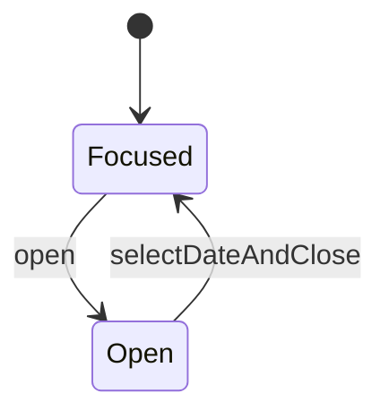

# From Runtime Rules to Compile-Time Guarantees: A State Machine Refactoring Journey

> Historical refactoring essay: the examples and third-party comparison are not the current package contract. See the [README](../README.md), [minimal API](minimal.md), and [supported API](api.md) before adapting this code.

It’s 10 PM. A critical bug just came in from production. Users can't submit the checkout form if they edit their cart after a failed payment attempt. Your mind races, trying to map the flow: `idle` -> `submitting` -> `error` -> `editing` -> `submitting`... wait, is that last transition even *allowed*? You start peppering `console.log(currentState)` throughout the codebase, beginning a painful game of "guess the state."

We've all been there. Modern state machine libraries like XState and Zag.js have been a godsend, bringing declarative order to this UI chaos. But what if we could eliminate this entire class of bugs *before* the code even runs?

This post is a journey. We're going to refactor a real-world, complex state machine—the date picker from the excellent Zag.js library—to **Type-State Programming** using `@doeixd/machine`. The goal is to move selected state and transition constraints into TypeScript so those modeled constraints can be checked before runtime.

### Part 1: The "Before" - The World of Declarative Configs

First, let's appreciate the original Zag.js machine. It's a clean, declarative statechart that clearly defines the component's behavior.

Here are some key snippets:

```typescript
// BEFORE: A snippet from the Zag.js date-picker machine
export const machine = createMachine<DatePickerSchema>({
  // 1. All logic lives in a single, large configuration object.
  initialState: "idle",

  // 2. States are identified by simple strings.
  states: {
    idle: {
      tags: ["closed"],
      // 3. Transitions are triggered by string-based events.
      on: {
        "TRIGGER.CLICK": {
          target: "open", // The next state is also a string.
          actions: ["focusFirstSelectedDate"], // Actions are string references.
        },
      },
    },
    open: {
      on: {
        "CELL.CLICK": [
          // 4. Conditional logic is a list of guarded transitions.
          {
            guard: "isAboveMinView", // Guards are also string references.
            actions: ["setFocusedValueForView", "setPreviousView"],
          },
          // ... many more conditions
        ],
      },
    },
  },

  // 5. The actual logic is implemented in a separate object.
  implementations: {
    guards: {
      isAboveMinView: ({ context }) => { /* ... */ },
    },
    actions: {
      focusFirstSelectedDate: (params) => { /* ... */ },
    },
  },
});
```

**What's great about this?**
It's declarative and tool-friendly. You can feed this object into a visualizer like Stately Studio and get a perfect diagram of your state machine.

**What's the hidden danger?**
The compiler has no deep understanding of the rules. It sees a blob of strings. If you accidentally write `send({ type: "TRIGER.CLICK" })` (with a typo), or try to send `"CELL.CLICK"` while in the `"idle"` state, TypeScript won't stop you. You'll only discover the mistake at runtime.

### Part 2: The Mindset Shift - Our New Guiding Principles

To convert this idiomatically to `@doeixd/machine`, we'll follow three core principles that will guide every decision we make.

1.  **States are Types, Not Strings:** The string `"open"` will become a TypeScript class `DatePickerOpenMachine`. Each state will be a distinct type with its own set of available methods.
2.  **Events are Methods, Not Messages:** The event `"CELL.CLICK"` will become a type-safe method `selectCell(date: DateValue)`. The compiler will only allow you to call methods that are valid for the current state's *type*.
3.  **Strict Separation of Concerns (Pure vs. Impure):** This is the most crucial architectural change.
    *   **The Machine:** Will contain *only* the pure, testable logic of calculating the next state. It will know nothing about the DOM, timers, or analytics.
    *   **The Runner:** A separate piece of code (like a React hook) will hold the machine. It will listen for state changes and execute all the "impure" side effects, like adding a DOM event listener or focusing an element.

With these principles, let's begin the conversion.

### Part 3: The "After" - Building with Compile-Time Guarantees

We'll break our new implementation into logical files, just as you would in a real project.

#### Step 1: Defining Our Data (`date-picker.types.ts`)

We start by separating static configuration from dynamic state. More importantly, we create state-specific contexts to make illegal data unrepresentable.

```typescript
// AFTER: date-picker.types.ts

// The static configuration of the date picker. Doesn't change.
export interface DatePickerConfig {
  locale: string;
  closeOnSelect: boolean;
  // ... other static props
}

// The base context shared by ALL states.
export interface BaseContext {
  value: DateValue[];
  focusedValue: DateValue;
  view: DateView;
}

// A specific context that ONLY exists when the picker is open.
export interface OpenContext extends BaseContext {
  // This property ONLY exists in the Open state.
  hoveredValue: DateValue | null;
}
```

**The Payoff:** This small change is a huge win. We've just told the compiler that `hoveredValue` is a piece of data that **cannot exist** unless the date picker is open. Trying to access it from a `DatePickerFocusedMachine` instance will now result in a compile-time error. The bug is caught the moment you type it.

#### Step 2: Modeling States as Classes (`date-picker.machine.ts`)

Now we build our states. Instead of strings in a config, they are classes. We'll also introduce the `@doeixd/machine` DSL (`describe`, `guarded`, `transitionTo`) to make our code self-documenting and ready for visualization.

```typescript
// AFTER: date-picker.machine.ts

import { MachineBase } from "@doeixd/machine";
import { transitionTo, guarded, describe } from '@doeixd/machine/primitives';

// Forward-declare our state classes
class DatePickerFocusedMachine extends DatePickerMachineBase {}
class DatePickerOpenMachine extends DatePickerMachineBase {}

// A base class holds shared logic (previously in Zag's `computed` block)
abstract class DatePickerMachineBase extends MachineBase<BaseContext> { /* ... */ }

// The "focused" state
export class DatePickerFocusedMachine extends DatePickerMachineBase {
  // The "TRIGGER.CLICK" event becomes a method.
  // We wrap it in the DSL for tooling.
  open = describe(
    "Open the calendar popover",
    transitionTo(DatePickerOpenMachine, () => {
      // The "actions" logic is now just plain TypeScript code.
      const focusedValue = this.context.value[0] ?? this.context.focusedValue;
      const nextContext: OpenContext = { ...this.context, focusedValue, hoveredValue: null };
      
      // We return a new instance of the next state's class.
      return new DatePickerOpenMachine(nextContext, this.config);
    })
  );
}

// The "open" state
export class DatePickerOpenMachine extends MachineBase<OpenContext> {
  // A complex transition like "CELL.CLICK" becomes a method.
  selectDateAndClose = describe(
    "Select a date and close the popover",
    guarded(
      // The guard's intent is declared, making the precondition obvious.
      { name: "isFinalSelection", description: "Ensures this is a valid final selection." },
      transitionTo(DatePickerFocusedMachine, (date: DateValue) => {
        // The guard's implementation is a simple `if` check inside the method body.
        if (!this.config.closeOnSelect) return this; 
        
        // The action's logic calculates the next context.
        const values = [...this.context.value];
        values[this.context.activeIndex] = date;
        const nextContext: BaseContext = { ...this.context, value: values, focusedValue: date };

        // The transition guarantees we land in the `Focused` state.
        return new DatePickerFocusedMachine(nextContext, this.config);
      })
    )
  );
}

export type DatePickerMachine = DatePickerFocusedMachine | DatePickerOpenMachine;
```

**The Payoff:**
1.  **Unbeatable Safety:** The `DatePickerFocusedMachine` type *does not have a `selectDateAndClose` method*. The compiler will physically stop you from calling it. The `DatePickerOpenMachine` type *does not have an `open` method*. An entire class of bugs is now structurally impossible to write.
2.  **Living Documentation:** The DSL wrappers make the code read like a specification. `describe` tells you what it does, `guarded` tells you the condition, and `transitionTo` tells you the outcome.

#### Step 3: The Missing Piece - Automatic Visualization

We've gained compile-time safety, but what about the clear, declarative diagrams we loved from the original version? Did we lose them? No. We get them for free.

Because we used the DSL primitives, we can now run the `@doeixd/machine` extraction tool:

```bash
npm run extract
```

This command reads our TypeScript code—without executing it—and generates a formal, XState-compatible statechart. For our new machine, it would look something like this:


*A simplified diagram generated directly from our TypeScript classes.*

**The payoff:** Modeled transition constraints become compiler-visible, while annotations can generate useful visual documentation from the same transition declarations. Tests are still needed to verify runtime behavior and generated artifacts.

#### Step 4: Handling the Real World - Side Effects (`use-date-picker.hook.ts`)

Our machine is now pure—it just calculates state. We need a "runner" to connect it to the real world (the DOM). Here's how that looks as a React hook, completing our separation of concerns.

```tsx
// AFTER: use-date-picker.hook.ts (A React Hook Runner)

import { useMachine } from '@doeixd/machine/react';
import { createDatePickerMachine, isState, DatePickerOpenMachine } from './';
import { trackDismissableElement } from '@zag-js/dismissable';
import { useEffect } from 'react';

export function useDatePicker(config: Partial<DatePickerConfig>) {
  // `useMachine` manages the pure machine instance for us.
  const [machine, actions] = useMachine(() => createDatePickerMachine(config));

  // The `useEffect` hook becomes our dedicated side-effect manager.
  useEffect(() => {
    // This effect runs ONLY when the machine enters the Open state.
    if (isState(machine, DatePickerOpenMachine)) {
      console.log("The date picker is now open. Setting up listeners.");
      
      const cleanupDismissable = trackDismissableElement(..., {
        onDismiss() {
          // The effect dispatches a pure event back to the machine.
          actions.close(); 
        },
      });
      
      // React handles the cleanup for us when the state changes.
      return () => {
        console.log("The date picker is closing. Cleaning up listeners.");
        cleanupDismissable();
      };
    }
  }, [machine, actions]); // This dependency array ensures the effect re-runs on state change.

  return {
    machine, // The current, reactive state for rendering
    actions, // A stable object to call transitions from our UI
    getTriggerProps: () => ({ onClick: () => actions.open() }),
  };
}
```

**The Payoff:** Our core logic is now completely decoupled from React and the DOM. We can test the entire date calculation and state transition flow in a Node.js environment without mocking a single DOM element. The `useDatePicker` hook can be tested separately using standard React testing tools. This separation makes the whole system more robust, maintainable, and easier to debug.

### But Wait, Isn't This Just... More Code?

Let's be honest. The Type-State version is more verbose than the original config. We've written multiple classes and types instead of one big object. So, what did we gain from this extra "boilerplate"?

What you're seeing isn't boilerplate; it's an **explicit contract**.

-   A `useEffect` hook with a complex dependency array is a hidden state machine. Its rules are implicit and fragile.
-   A declarative config is a set of rules for a runtime interpreter.
-   **A Type-State machine is a contract enforced by the compiler.**

The extra code makes the state transitions, preconditions, and outcomes explicit and undeniable parts of your program's structure. This upfront investment pays for itself tenfold by preventing bugs, simplifying debugging (the compiler finds them for you!), and making the code fearless to refactor.

### Conclusion: Your Compiler is Now Your Co-Pilot

We have successfully refactored a complex component, moving its logic from a runtime-interpreted configuration to a compile-time-verified structure. We didn't lose the declarative power or the ability to visualize our logic; we enhanced it with a level of safety that wasn't possible before.

By embracing Type-State Programming, your compiler graduates from a simple syntax checker to an intelligent co-pilot that understands the *behavioral rules* of your application. It doesn't just check if you spelled a function name correctly; it checks if you're *allowed* to call it at all.

That feeling of confidence—knowing that an entire category of state-related bugs can no longer be written—is a superpower.

#### Key Takeaways: A Shift in Thinking

| Benefit | The Old Way (Declarative Config) | The New Way (Type-State) |
| :--- | :--- | :--- |
| **Safety Net** | Rules are checked at **runtime**. | Rules are enforced at **compile-time**. |
| **Invalid States**| Handled with guards and runtime errors. | **Unrepresentable**. The code won't compile. |
| **Side Effects** | Mixed into the machine definition. | Strictly separated into a "runner" (e.g., a hook). |
| **Tooling** | A visualizer reads the config object. | An extractor reads the **TypeScript code itself** to create visuals. |
| **Confidence** | "I hope my tests cover this edge case." | "The compiler guarantees this edge case can't happen." |
